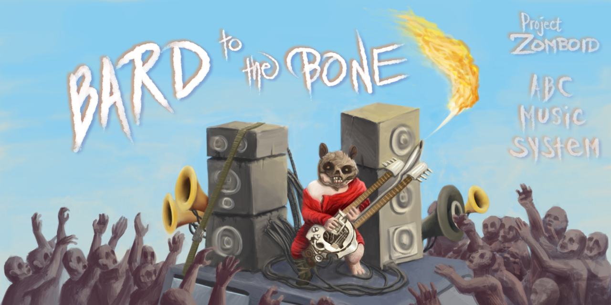

 

#### [**Bard-To-The-Bone**](https://steamcommunity.com/sharedfiles/filedetails/?id=3484029638) is a Project Zomboid mod that lets players perform music using ABC notation, with support for all vanilla instruments and custom ones.

### Disclaimers:
1. I am not a musically inclined person, so there's probably obvious mistakes made / issues with this system. If you're expecting a high fidelity experience this mod is not for you.
2. How Project Zomboid handles threads, framerates, and ticks can impact timings and playback may suffer because of this.
3. **This mod is meant as a casual instrument system.** I won't be introducing a skill system integration, nor a way to manually play instruments.  If you'd like a music mod that integrates well with a skill system (and a number of wonderful features) check out [Lifestyle](https://steamcommunity.com/sharedfiles/filedetails/?id=2997342681); If you'd like a much deeper immersive mod that requires manually playing instruments see [Bard Interactive Music](https://steamcommunity.com/sharedfiles/filedetails/?id=3176639185).
  

### What is ABC Notation?

[ABC notation](https://en.wikipedia.org/wiki/ABC_notation) is a simple, text-based music format using letters and numbers to represent notes, rhythms, and other musical elements. It's designed to easily write and share music, especially melodies, without needing specialized music software.

**Notable Games that use ABC Notation Music Systems:**
- The Lord of the Rings Online (LOTRO)
- Starbound
- UnReal World
- Wurm Online
- Spacestation 13
  

### [Bard to The Bone Song Library](./songLibrary#readme)
**Collection of 900+ songs ready to be entered in-game.** 
*Modified from the [Starbound Song Pack](https://github.com/luxx/sbsp)*
  

**Useful Links:**

**[Online ABC Player and Editor](https://abc.rectanglered.com/)** 
An online interface for playing and editing ABC notations.

**[Online MIDI to ABC Tool](https://michaeleskin.com/tools/midi2abc/midi2abc.html)** 
Convert MIDIs of songs to ABC for use in the game.

**[abcnotation.com](https://abcnotation.com/)** 
A great website that features all things ABC-notation, includes: thousands of public-domain songs, links to various related programs and information.
  

**Credits:**
- Music Note Sounds - Generated using fluidSynth & FluidR3_GM.sf2, [SS13-TG](https://github.com/tgstation/tgstation)
- Default Songs - [abcnotation](https://abcnotation.com) & [@duVillage](https://www.youtube.com/@duVillage)
- Song Library - [Luxx's Starbound Song Pack](https://github.com/luxx/sbsp)
- CrystalChris - Animations
- [Shurutsue](https://github.com/Shurutsue) for helping with troubleshooting/research.
###
